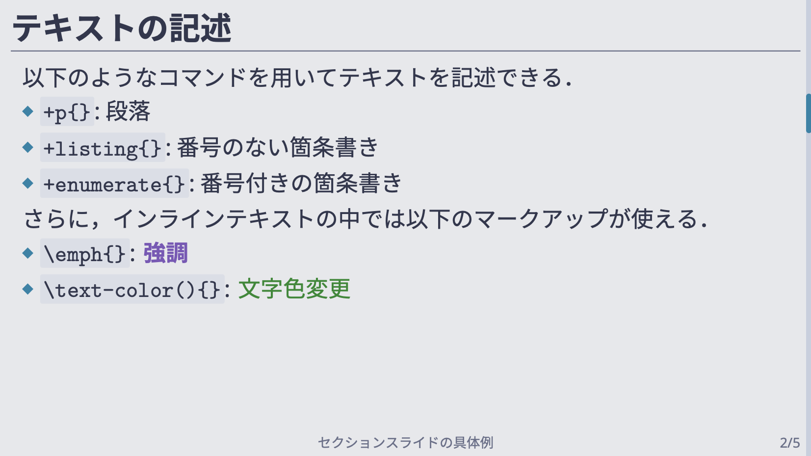

# SLyDIFi

([English README is here](README.md))

SLyDIFi は， [SATySFi](https://github.com/gfngfn/SATySFi) でスライドを作成するためのパッケージ（クラスファイル）です．
LaTeX でいうところの beamer に相当しています（機能は最低限のもののみ用意しています）．

## Installation & Usage

[Satyrographos](https://github.com/gfngfn/SATySFi/wiki/Satyrographos)
を用いてインストールすることが出来ます．
より具体的には， Satyrographos の入った環境で以下のように打てばインストールできます:


```
opam install satysfi-class-slydifi
satyrographos install
```

正しくインストールされたかどうか動作を確認したければ，
適当なディレクトリ下で，以下のように記述された `minimum.saty` を用意してください:

```
@require: class-slydifi/theme/plain

document '<
  +frame{\SLyDIFi; のテスト}<
    +p{Hello, \SLyDIFi;!}
  >
>
```

これで SATySFi を走らせて以下のような PDF が生成されたら，正常に動いています．


## Gitpodを使ったデモ

[Gitpod](https://gitpod.io) を使って，SLyDIFi の使用感を試すことができます．

[](https://gitpod.io/#https://github.com/monaqa/slydifi)

`demo/demo.saty` を自由に編集し，ターミナル上で `satysfi demo/demo.saty` とすることでPDF (`demo/demo.pdf`) を生成できます．
[SATySFi の docker image](https://github.com/amutake/satysfi-docker) を使用しているため，
`opam` / `satyrographos` コマンドで他のパッケージを入れることもできます．


## SLyDIFi でできること

SLyDIFi は以下の機能を有しています．

### フレームの作成

標準のスライドテーマでは，以下の3種類のスライドを用意しています，

* 通常のスライド
* タイトルスライド
* セクションスライド

具体的なレイアウトについては，後述の「テーマの選択と変更」を参照してください．

### スライド内でのマークアップ

スライド内では，以下のマークアップを行うことが出来ます．

* 段落
* 箇条書き
* 図表の挿入
* 脚注の挿入

また，インラインテキストマークアップとして以下のコマンドを用意しています（テーマによって異なる場合があります）．

* ``\emph``
* ``\link``
* ``\text-color``
* ``\uline``
* ``\stroke``

### テーマの選択と変更

SLyDIFi はテーマの変更に対応しています．
標準では現時点で3種類のテーマを用意しています．
テーマは自作することも可能ですし，既存のテーマを自身でカスタマイズすることもできます
（ただし，そのためのドキュメントはまだ作成されていません）．

以下は標準で用意されたテーマの外観と導入方法です．

#### Plain

装飾のないシンプルなテーマ．

```
@require: class-slydifi/theme/plain
```

[](example/plain.pdf)

より詳しいスライドの例は [こちら](example/plain.pdf) をご覧ください。

#### Hakodate

[Gruvbox](https://github.com/gruvbox-community/gruvbox)
の色をベースにしたテーマ．

```
@require: class-slydifi/theme/hakodate
```

[](example/hakodate.pdf)

より詳しいスライドの例は [こちら](example/hakodate.pdf) をご覧ください。

デフォルトの設定では [M+ フォント](https://mplus-fonts.osdn.jp/about.html) を使用しているため、
システムに M+ フォントをインストールした上で以下を実行する必要があります。

```
satyrographos install --system-font-prefix 'system:'
```

ただし、フォントの設定は文書ファイル内で自由に変更することができます。

#### Akasaka

灰色のスタンダードなテーマ．

```
@require: class-slydifi/theme/akasaka
```

[](example/akasaka.pdf)

より詳しいスライドの例は [こちら](example/akasaka.pdf) をご覧ください。

デフォルトの設定で使用するには [Noto Sans](https://www.google.com/get/noto/) 系のフォント
（Noto Sans 及び Noto Sans CJK JP）
のインストールと，hash ファイルによる紐付けが必要です．
これは既に satyrographos に登録されており，以下のコマンドでインストール可能です:

```
opam install satysfi-fonts-noto-sans
opam install satysfi-fonts-noto-sans-cjk-jp
satyrographos install
```

上記パッケージについての詳細は
[SATySFi-fonts-noto-sans](https://github.com/zeptometer/SATySFi-fonts-noto-sans)
及び
[SATySFi-fonts-noto-sans-cjk-jp](https://github.com/zeptometer/SATySFi-fonts-noto-sans-cjk-jp)
を参照．
また、フォントの設定は文書ファイル内で自由に変更することができます。

#### Arctic

[iceberg.vim](https://github.com/cocopon/iceberg.vim) の色をベースにした、涼しい印象のテーマ。

```
@require: class-slydifi/theme/arctic
```

[](example/arctic.pdf)

より詳しいスライドの例は [こちら](example/arctic.pdf) をご覧ください。

こちらもデフォルトの設定では
[IBM Plex Sans JP](https://github.com/IBM/plex/releases/tag/v5.2.1)
系のフォントが必要ですが、フォント設定は文書ファイル内で変更できます。

### 設定変更

各テーマにはいくつか設定可能なパラメータがあり、
文書ファイル内でいくつかの設定値を変更することができます。主に

- フォント（書体、サイズなど）
- 色（文字色、背景色など）
- 長さ（紙面とフッタの間など）

といった設定値を操作することが可能です。たとえば Akasaka テーマでは

```
@require: class-slydifi/theme/akasaka

document '<

  +set-config(|
    SlydifiThemeAkasaka.default-config with  % 下に書いたフィールド以外はデフォルト値を使う
      font-frame-title = (fun ctx -> ctx |> SlydifiThemeAkasaka.default-config#font-frame-title |> set-font-size 20pt);
      color-bg = Color.of-css `lightcyan`;
      color-emph = Color.of-css `darkred`;
      length-frame-title-height = 28pt;
  |);

  +frame{フレーム}<
    ...
  >
>
```

のように書くことで、フレームのタイトルのフォントサイズやスライドの背景色といった要素を変更することができます。
詳しい例は [こちら](example/akasaka-user-config.saty) をご覧ください。

## ToDo

* block 環境に相当するコマンド
