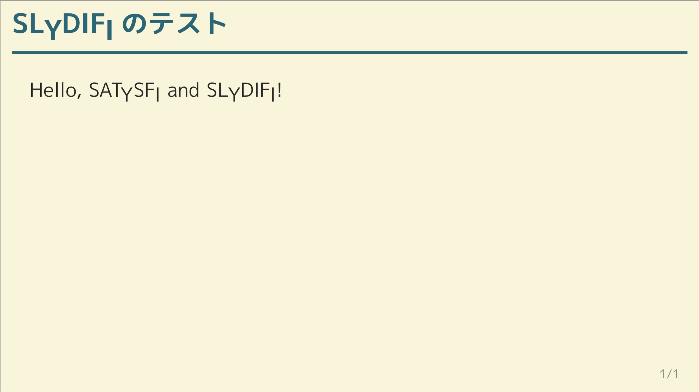
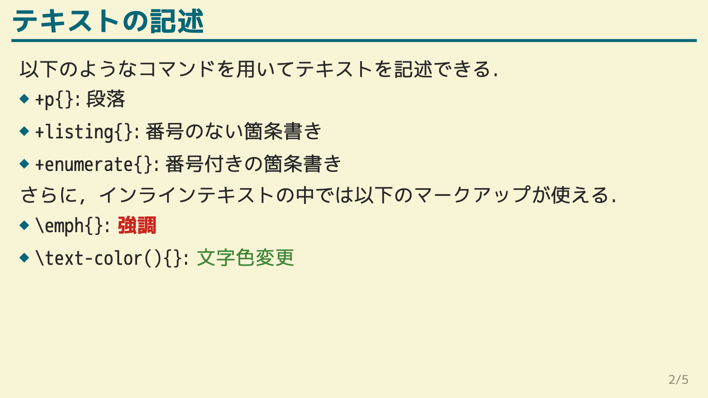
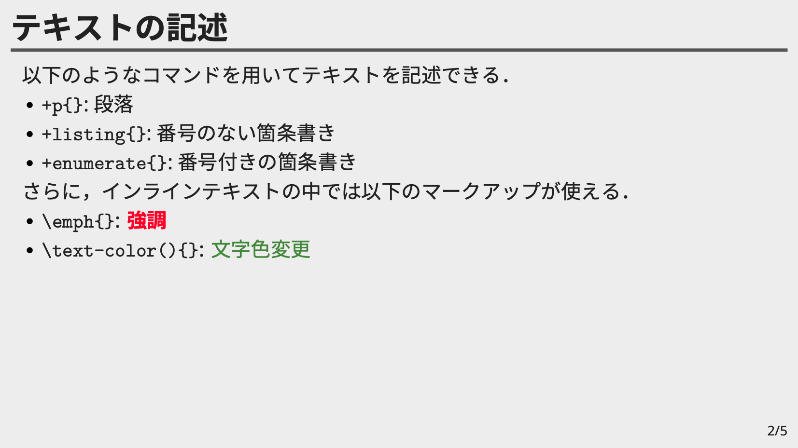

# SLyDIFi

（[日本語版はこちら](README-ja.md)）

SLyDIFi is a package (class file) for creating slides with [SATySFi](https://github.com/gfngfn/SATySFi) . It is equivalent to beamer in LaTeX (only the minimum functions are available).

## Installation & Usage

It can be installed using [Satyrographos](https://github.com/gfngfn/SATySFi/wiki/Satyrographos).<br>Concretely, you can install SLyDIFi with the following command:

```
opam install satysfi-class-slydifi
satyrographos install
```

If you want to check the operation to see if it was installed correctly, prepare `minimum.saty` with the following description under an appropriate directory:

```
@require: class-slydifi/theme/plain

document '<
  +frame{\SLyDIFi; のテスト}<
    +p{Hello, \SLyDIFi;!}
  >
>
```

If you run `satysfi` command and the following PDF is generated, it is working properly (please prepare the necessary fonts as appropriate).



## Demo with Gitpod

Try it in [Gitpod](https://gitpod.io)!

[](https://gitpod.io/#https://github.com/monaqa/slydifi)

You can create PDF (`demo/demo.pdf`) by editing `demo/demo.saty` freely and run `satysfi demo/demo.saty` on console.
You can also install other packages via `opam` / `satyrographos` command, because this demo uses [SATySFi's docker image](https://github.com/amutake/satysfi-docker).


## What You Can Do with SLyDIFi

SLyDIFi has the following functions.

### Creating Frames

In the standard slide theme, the following three types of slides are available.

- Normal slide
- Title slide
- Section slide

For the specific layout, refer to "Selecting and Changing Themes" below.

### Markup in Frames

The following markup can be done in the frame.

- Paragraph
- Itemize (bullets)
- Insertion of figures
- Insertion of footnotes

In addition, the following commands are available as in-line text markup (it varies depending on the theme).

- ``\emph``
- ``\link``
- ``\text-color``
- ``\uline``
- ``\stroke``

### Selecting and Changing Themes

SLyDIFi supports multiple themes. At present, three types of themes are available as standard. You can create your own theme, or you can customize an existing theme yourself (although no documentation has been created for that).

The following is the appearance and introduction method of the theme prepared as standard.

#### Plain

A simple theme without decoration.

```
@require: class-slydifi/theme/plain
```

[](example/plain.pdf)

See [here](example/plain.pdf) for further examples.

#### Hakodate

A theme based on the colors of [Gruvbox](https://github.com/gruvbox-community/gruvbox) .

```
@require: class-slydifi/theme/hakodate
```

[](example/hakodate.pdf)

See [here](example/hakodate.pdf) for further examples.


To use this theme with default configuration, you need to install [M + font](https://mplus-fonts.osdn.jp/about.html) and run the following command:

```
satyrographos install --system-font-prefix 'system:'
```

Note that the font settings can be changed freely in the document file.

#### Akasaka

Gray standard theme.

```
@require: class-slydifi/theme/akasaka
```

[](example/akasaka.pdf)

See [here](example/akasaka.pdf) for further examples.

To use this theme with default configuration, you need to install [Noto Sans](https://www.google.com/get/noto/) font family (Noto Sans and Noto Sans CJK JP) and link it with a hash file.<br>Now it is already registered with Satyrographos and can be installed with the following command:

```
opam install satysfi-fonts-noto-sans
opam install satysfi-fonts-noto-sans-cjk-jp
satyrographos install
```

See
[SATySFi-fonts-noto-sans](https://github.com/zeptometer/SATySFi-fonts-noto-sans)
and
[SATySFi-fonts-noto-sans-cjk-jp](https://github.com/zeptometer/SATySFi-fonts-noto-sans-cjk-jp)
for details.

And note that, the font settings can be changed freely, too.

#### Arctic

A COOL theme based on the colors of [iceberg.vim](https://github.com/cocopon/iceberg.vim).

The default settings also require a [Noto Sans](https://www.google.com/get/noto/) type font, but you can change the font settings in the document file.

### Changing Configuration

Each theme has a number of configurable parameters, which you can change on the document file.
The main types of setting values that can be changed are as follows:

- font (font name, size, etc.)
- color (text color, background color, etc.)
- length (margin between paper border and footer, etc.)

For example, in the Akasaka theme, you can change settings such as the font size of the frame title and the background color of the slide as follows:

```
@require: class-slydifi/theme/akasaka

document '<

  +set-config(|
    SlydifiThemeAkasaka.default-config with  % 下に書いたフィールド以外はデフォルト値を使う
      font-frame-title = (fun ctx -> ctx |> SlydifiThemeAkasaka.default-config#font-frame-title |> set-font-size 20pt);
      color-bg = Color.of-css `lightcyan`;
      color-emph = Color.of-css `darkred`;
      length-frame-title-height = 28pt;
  |);

  +frame{フレーム}<
    ...
  >
>
```
```
@require: class-slydifi/theme/akasaka

document '<

  +set-config(|
    SlydifiThemeAkasaka.default-config with  % 下に書いたフィールド以外はデフォルト値を使う
      font-frame-title = (fun ctx -> ctx |> SlydifiThemeAkasaka.default-config#font-frame-title |> set-font-size 20pt);
      color-bg = Color.of-css `lightcyan`;
      color-emph = Color.of-css `darkred`;
      length-frame-title-height = 28pt;
  |);

  +frame{フレーム}<
    ...
  >
>
```

See [こちら](example/akasaka-user-config.saty) for more detailed examples.

## ToDo

- Command equivalent to `block` environment in Beamer
