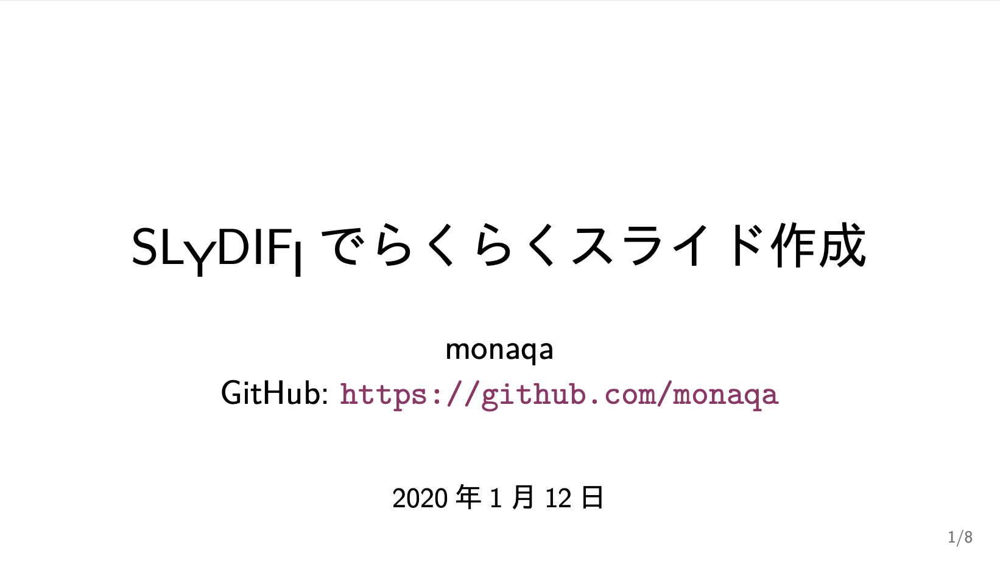
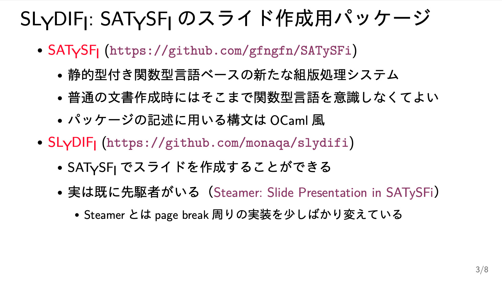
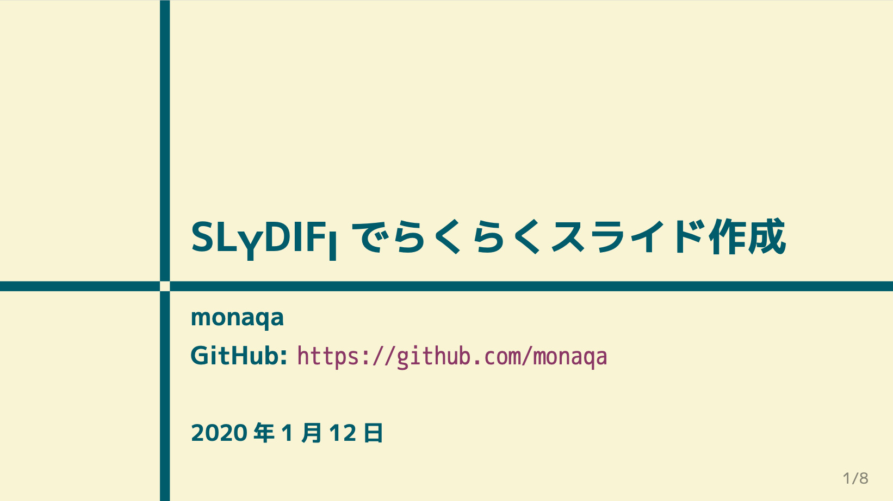
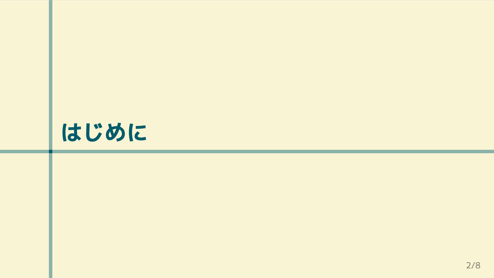
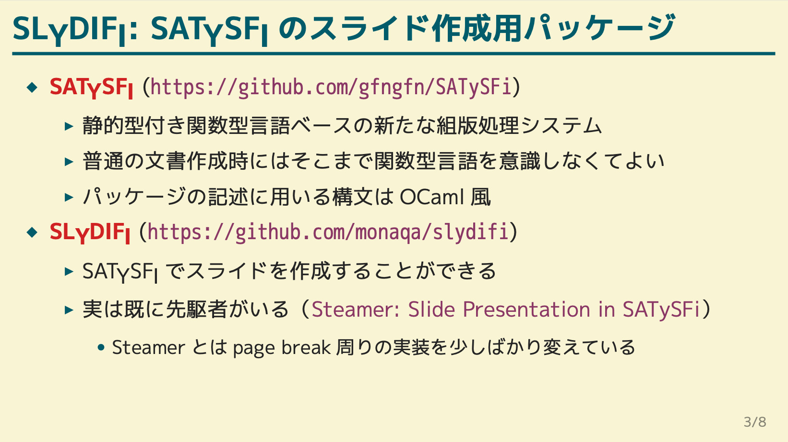
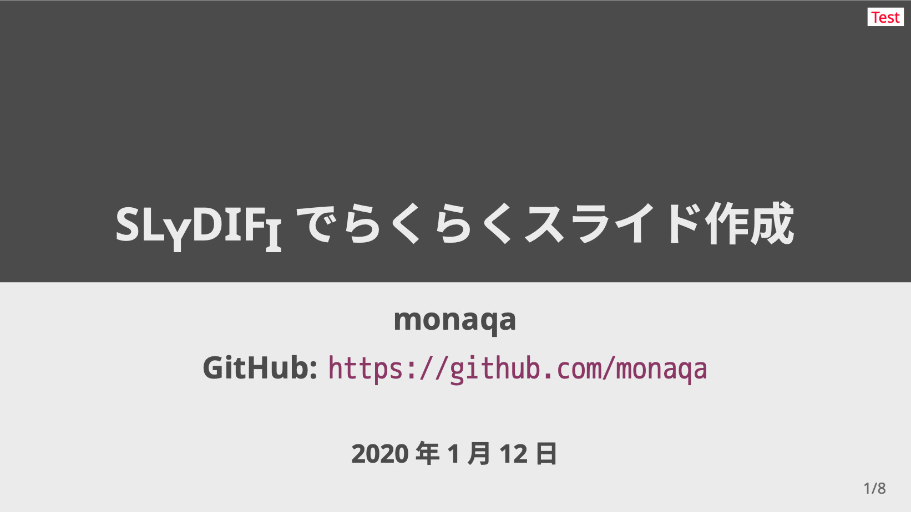
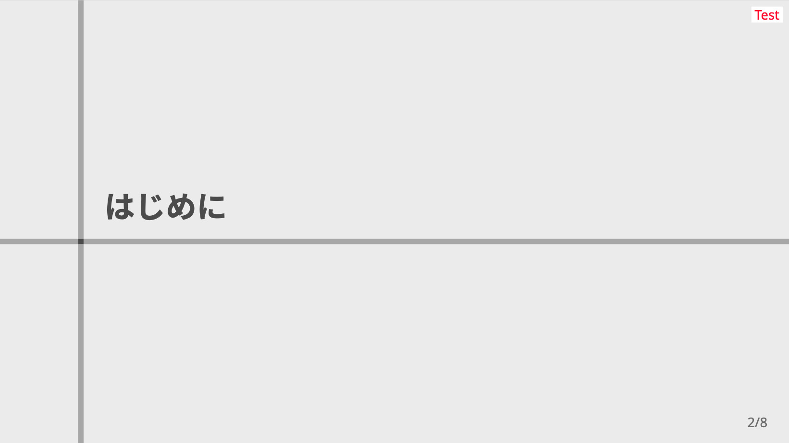
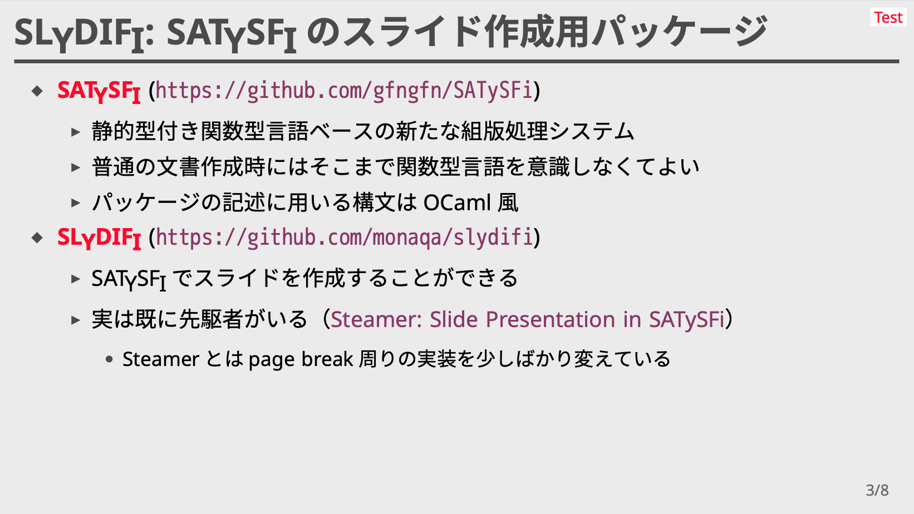

# SLyDIFi

（[日本語版はこちら](README-ja.md)）

SLyDIFi is a package (class file) for creating slides with [SATySFi](https://github.com/gfngfn/SATySFi) . It is equivalent to beamer in LaTeX (only the minimum functions are available).

## Installation & Usage

It can be installed using [Satyrographos](https://github.com/gfngfn/SATySFi/wiki/Satyrographos).<br>Concretely, you can install SLyDIFi with the following command:

```
opam install satysfi-class-slydifi
satyrographos install
```

If you want to check the operation to see if it was installed correctly, prepare `minimum.saty` with the following description under an appropriate directory:

```
@require: code
@require: annot
@require: list
@require: slydifi/theme/plain

SlydifiPlain.document(|
  draft-mode = false;
|)'<
  +frame{Test of \SLyDIFi;}<
    +p{Hello, \SLyDIFi;!}
  >
>
```

If you run `satysfi` command and the following PDF is generated, it is working properly (please prepare the necessary fonts as appropriate).


## Demo with Gitpod

Try it in [Gitpod](https://gitpod.io)!

[](https://gitpod.io/#https://github.com/monaqa/slydifi)

You can create PDF (`demo/demo.pdf`) by editing `demo/demo.saty` freely and run `satysfi demo/demo.saty` on console.
You can also install other packages via `opam` / `satyrographos` command, because this demo uses [SATySFi's docker image](https://github.com/amutake/satysfi-docker).


## What You Can Do with SLyDIFi

SLyDIFi has the following functions.

### Creating Frames

In the standard slide theme, the following three types of slides are available.

- Normal slide
- Title slide
- Section slide

For the specific layout, refer to "Selecting and Changing Themes" below.

### Markup in Frames

The following markup can be done in the frame.

- Paragraph
- Itemize (bullets)
- Insertion of figures
- Insertion of footnotes

In addition, the following commands are available as in-line text markup.

- `\textbf`
- `\emph`
- `\link`

### Selecting and Changing Themes

SLyDIFi supports multiple themes. At present, three types of themes are available as standard. You can create your own theme, or you can customize an existing theme yourself (although no documentation has been created for that).

The following is the appearance and introduction method of the theme prepared as standard.

#### Plain

A simple theme without decoration.






You can use it by writing:

```
@require: class-slydifi/theme/plain

SlydifiPlain.document(|
  draft-mode = false;
|)'<

(body)

>
```

#### Hakodate

A theme based on the colors of [Gruvbox](https://github.com/gruvbox-community/gruvbox) .







You can use it by writing:

```
@require: class-slydifi/theme/hakodate

SlydifiHakodate.document(|
  draft-mode = false;
|)'<

(body)

>
```

To use it, you need to install [M + font](https://mplus-fonts.osdn.jp/about.html) and link it with a hash file. This installation process may be automated using Satyrographos in the future.

#### Akasaka

Gray standard theme.







You can use it by writing:

```
@require: class-slydifi/theme/akasaka

SlydifiAkasaka.document(|
  draft-mode = false;
  header-text = {(Text you want to add in header)};
|)'<

(body)

>
```

To use it, you need to install [Noto Sans](https://www.google.com/get/noto/) font family (Noto Sans and Noto Sans CJK JP) and link it with a hash file.<br>Now it is already registered with Satyrographos and can be installed with the following command:

```
opam install satysfi-fonts-noto-sans
opam install satysfi-fonts-noto-sans-cjk-jp
satyrographos install
```

See
[SATySFi-fonts-noto-sans](https://github.com/zeptometer/SATySFi-fonts-noto-sans)
and
[SATySFi-fonts-noto-sans-cjk-jp](https://github.com/zeptometer/SATySFi-fonts-noto-sans-cjk-jp)
for details.

## ToDo

- Command equivalent to `block` environment in Beamer
