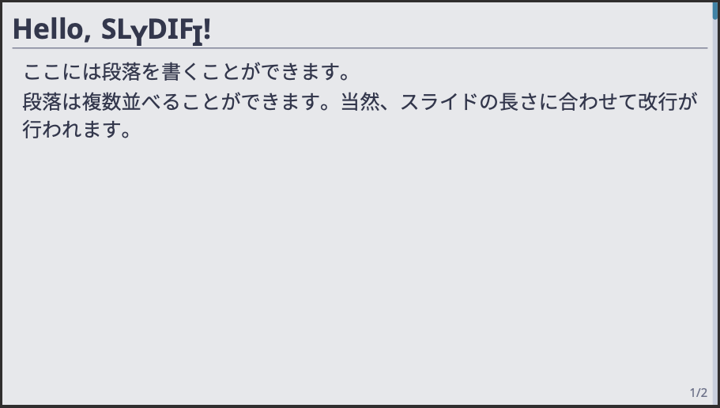

# 基本的なスライド

ここでは Arctic テーマを用いてスライドを作成してみましょう。
SLyDIFi は非常に自由度が高いため、テーマによっては以下と同じインターフェースが使えないかもしれません。

## 文書ファイルの作成

まずは文書ファイルを作りましょう。
以下のように書き、 `slide.saty` などの名前で保存します（名前は何でも構いませんが、ビルドコマンドを適宜変えてください）。

```satysfi
@require: class-slydifi/theme/arctic

document '<
>
```

この状態でビルドしてみましょう。以下、ビルドは常に以下のコマンドで行うことができます。

```
satysfi slide.saty
```

これでビルドでき、成功すれば `slide.pdf` が出力されるはずです。
`slide.pdf` の中身は現時点では白紙ですが、問題ありません。
まだ上の時点では何も内容が書かれておらず、これから追加するからです。

## フレームの作成

SLyDIFi では、スライドを構成する1ページのことを "frame" と呼びます。
最も基本的な frame は、 `+frame{ ... }< ... >` という形のコマンドで作成することができます。

```satysfi
{{#include ../code/making_slides/slide.saty:example-frame}}
```

`arctic` テーマの場合、このように書けば以下のようなフレームが生成されます。
当然、生成されるフレームのレイアウトはテーマによって異なります。



`+frame` コマンドは必須引数を2つとります。

* `title` (*inline-text*): フレームのタイトル。
* `inner` (*block-text*): フレームの本文。

タイトルの中ではインラインコマンドを、本文の中ではブロックコマンドを使うことができます。
上の例では段落を生成する `+p{ ... }` コマンドが用いられていますが、
他にも `+listing{ ... }` コマンドを用いて箇条書きを書くことなどができます。

## タイトルフレームの作成

ほとんどのスライドには、冒頭にスライド全体のタイトル、発表者の名前、発表日といった事項を示す表紙のフレームが存在します。
SLyDIFi では `+make-title` コマンドによってこれを作成することができます。

```satysfi
{{#include ../code/making_slides/slide.saty:title}}
```

`+make-title` は **レコード型** をとり、そこにスライドのタイトルや発表者名、発表日といった事項を記入します。
レコードのフィールドは `arctic` では以下のとおりです。

* `title` (*inline-text list*): スライド全体のタイトル。
* `author` (*inline-text list*): 発表者の氏名。
* `date` (*inline-text list*): 発表日。

arctic テーマでは比較的シンプルに、3つの要素だけを記述することができますが、
このフィールドの内容はテーマによって変わる可能性があります
（たとえば所属を記入する欄が設けられたテーマもあるかもしれません）。
またいずれも *inline-text list* 型を持っています。
*inline-text* 型とは異なり `{| |}` という括弧で囲む必要があるものの、
`|` を区切りとして複数行に渡るテキストを記述することができます。
実体は単なる *inline-text* のリストですから、リスト記法を用いて

```
    title = [ {Test of \SLyDIFi;}; {複数行に跨るタイトル} ];
```

などと書いても構いません（上の `{| |}` という書き方は単なる糖衣構文です）。また、

```
    title = {
      | Test of \SLyDIFi;
      | 複数行に跨るタイトル
      |};
```

のように改行して書くこともできます。

## セクションフレームの作成

```satysfi
{{#include ../code/making_slides/slide.saty:section}}
```
