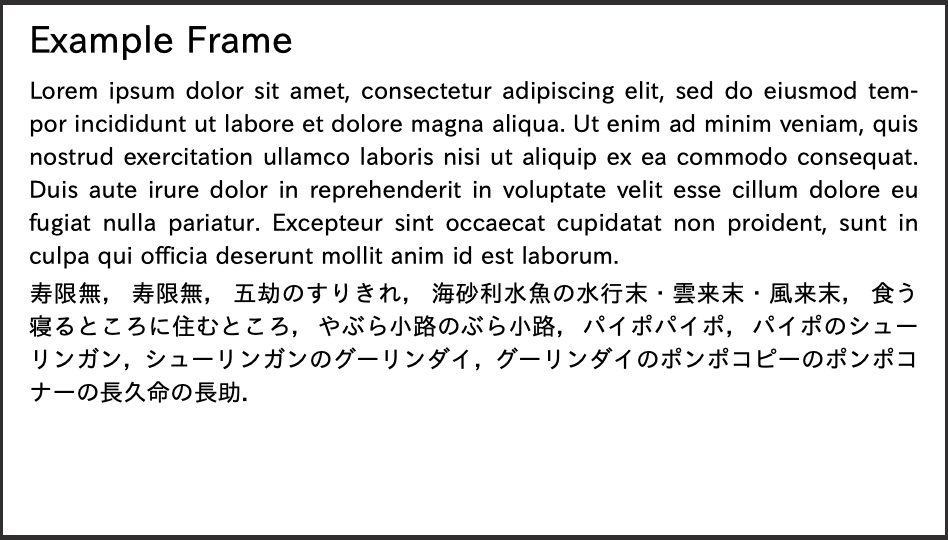

# ミニマルなテーマファイル

まずはスライドのテーマとして必要な最低限の要素を備えたテーマファイルを作成してみます。

## ヘッダファイル

`my_simple_theme.satyh` ファイルを作成し、以下のように書いてみましょう。

```satysfi
@require: class-slydifi/slydifi

module SlydifiThemeMySimple: sig

  %% ここにシグネチャ（関数やコマンドの型）を書く

end = struct

  %% ここに定義を書く

end
```

モジュール `SlydifiThemeMySimple` を作成しました。
モジュール名は何でも良いですが、他とかぶらない名前とするのが良いでしょう。
モジュールでは、以下に示す3つの関数と1つのコマンドを提供します。
これらはスライドのテーマファイルとして必要最低限の要素であるといえます。
特に `document` 関数と `+frame` コマンドはユーザが直接用いるインターフェースのため、大切です。

```satysfi
{{#include ../code/making_theme/1_minimal/my_simple_theme.satyh:signature}}
```

それぞれの関数・コマンドの定義を順に説明します。

### layout

`layout` はスライド全体に関わる設定値を表すものです。
シグニチャには *frame-layout* 型と書いてありますが、その実体は

```
type frame-layout = (|
  %% 紙面の横幅。
  paper-width: length;
  %% 紙面の縦幅。
  paper-height: length;
  %% テキスト描画領域の横幅。
  text-width: length;
  %% テキスト描画領域の高さ。
  text-height: length;
  %% 紙面の左端から、テキスト描画領域の開始点までのx軸方向の長さ。
  text-horizontal-margin: length;
  %% 紙面の上端から、テキスト描画領域の開始点までのy軸方向の長さに関するパラメータ。
  text-vertical-margin: length;
|)
```

というレコードです。見れば分かるように、紙面のサイズやテキスト描画領域の横幅といった、
いかなるスライドを作成する際にも欠かせない情報を格納しています。
実際に `layout` を定義してみましょう。
たとえば、16:9 の縦横比を持つスライドを作成したい場合は以下のように設定するのが無難でしょう。

```satysfi
{{#include ../code/making_theme/1_minimal/my_simple_theme.satyh:layout}}
```

### document 関数

`stdja` などの一般的な SATySFi のクラスファイルと同様、 SLyDIFi にも document 関数が必要です。
定義は以下のようになります。


```satysfi
{{#include ../code/making_theme/1_minimal/my_simple_theme.satyh:document}}
```

`SlydifiScheme.document-scheme` は、 SLyDIFi 固有の document 関数をかんたんに生成できるようにするための関数です。
レイアウト情報を元に適切なサイズの紙面を作成し、与えられた内容をもとにスライドを作成することができます。
`SlydifiScheme.document-scheme` 関数の引数は以下のようになっています。

* `layout` (*frame-layout*): フレーム全体に関係するレイアウト。
* `init-ctx` (*context -> context*): 文書全体にかけるテキスト処理文脈の変換関数。
* `hookf` (*(|page-number : int|) -> (length * length) -> unit*): フック関数。スライドの最後に起動する。ページの総数を受け取りたい場合などに便利。
* `inner` (*block-text*): スライド本体のブロックテキスト。

`layout` は先程定義したものを用いています。
`init-ctx` はデフォルトの書式設定を表しますが、基本的に恒等関数で問題ありません。
また `hookf` は総ページ数などを取りたいときに用いることがあるものの、今は空の関数で問題ありません。

### frame-normal

```satysfi
val frame-normal: ((| title: inline-text; inner: block-text |)) Frame.frame
```

`frame-normal` は通常のフレームのテンプレートに相当するもので、 *Frame.frame* 型を持ちます。
`frame-normal` は以下のように定義できます。


```satysfi
{{#include ../code/making_theme/1_minimal/my_simple_theme.satyh:frame-normal}}
```

まずいちばん最後の行に注目しましょう。

```
Frame.make layout f
```

`Frame.make` は以下の2つの引数を取り、 *Frame.frame* 型の値を新たに作成する関数です。

* `layout` (*frame-layout*): フレーム全体に関係するレイアウト。
* `f` (*context -> 'content -> (block-boxes * graphics list)*): フレーム本体を生成するための関数

`f` の2番目の引数 `'content` は型パラメータであり、
`frame-normal` では *(| title: inline-text; inner: block-text |)* というレコード型がその実体となっています。

第2引数に相当する `f` を定義しているのが中盤の部分で、定義は以下のようになっています。

```
    let f ctx content =
      % タイトルのブロックテキスト
      let bb-title =
        let ctx = ctx |> font-slide 28pt in
        let ib-title = read-inline ctx content#title in
        line-break true true ctx (ib-title ++ inline-fil)
      in
      % 本文のブロックテキスト
      let bb-inner = read-block (ctx |> font-slide 18pt) content#inner in
      (bb-title +++ bb-inner, [])
```

このように書くことで、
「28pt サイズのフォントでタイトル (`content#title`) を入力した後改段落し、
18pt サイズのフォントで本文 (`content#inner`) を書く」
というレイアウトのフレームが実現できます。

### +frame コマンド

`+frame` コマンドはタイトルと本文を引数にとり、実際にユーザの入力からフレームを作成するコマンドです。
以下のように定義します。

```
{{#include ../code/making_theme/1_minimal/my_simple_theme.satyh:frame-command}}
```

`+SlydifiScheme.genframe` というコマンドをそのまま使っています。
これは指定された *Frame.frame* とコンテンツからフレームを作成するコマンドです。

より具体的には、 `+SlydifiScheme.genframe(frame)(n-layer)(content);` という形で使います。

* `frame` (*'content Frame.frame*): 対象となるフレーム。
* `n-layer` (*int*): レイヤーの数。
* `content` (*'content*): 対象となるコンテンツ。

レイヤーはオーバーレイを扱うときに用います。
今回作成する `+frame` 関数はオーバーレイの機能をつけないため、 `n-layer` の値は 1 固定で構いません。

### 最終的なヘッダファイル

最終的には以下のようなヘッダファイルとなります。

```satysfi
{{#include ../code/making_theme/1_minimal/my_simple_theme.satyh:all}}
```

シンプルではあるものの、100行足らずでテーマファイルができました。

## テーマファイルを実際に使ってみる

テーマファイルの見た目がどのようになるのか、実際に試してみましょう。

```
{{#include ../code/making_theme/1_minimal/example.saty:all}}
```

`satysfi example.saty` で PDF を作成すれば、以下のような出力が得られるはずです。



`frame-normal` で指定したレイアウトそのままの出力が得られています。
